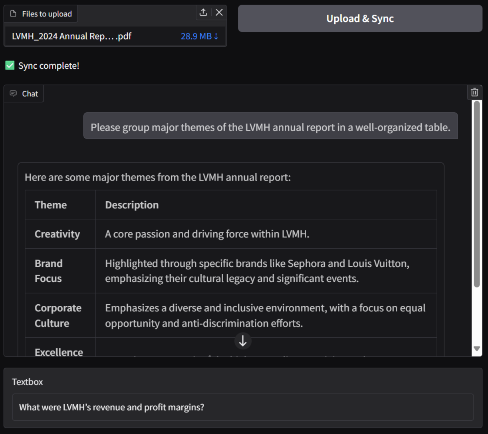

# Anyfile-Agent
Anyfile-Agent lets you query your own documents using natural language. It indexes a folder of files, converts CSV and Excel sheets into a DuckDB database, and performs semantic search via vector retrieval. Built with LangChain/LangGraph, this interactive LLM agent combines RAG-based retrieval and SQL querying so you can “chat” with your data.

## Features
- **Multi-format ingestion** – Images are processed through OCR so their text is indexed. PDFs, Word docs, PowerPoint, Markdown, HTML, and plain text are split into searchable chunks. 
- **Data summarization** – CSV and Excel files are loaded into DuckDB tables. Summary cards for each table are added to the vector index.
- **Embeddings & retrieval** – Documents are embedded with `GoogleGenerativeAIEmbeddings` and stored in a FAISS vector database for fast top-k semantic search.
- **SQL integration** – The agent can issue DuckDB queries over your uploaded spreadsheets. Only `SELECT` and `PRAGMA` statements are allowed for safety.
- **Persistent conversations** – The agent saves its conversation history with you to SQLite with a `thread_id` so that you can resume or switch between chats.
- **Gradio App** – Run a user-friendly interface for interactive sessions.
- **Developer Tools & CI** – Linting with ruff and black, unit tests with pytest, end‐to‐end smoke tests in GitHub Actions.

## Installation
1. Install system packages needed for OCR (first time only):
   ```bash
   sudo apt update
   sudo apt install -y tesseract-ocr libtesseract-dev
   ```
2. Install the Python package and dependencies:
   ```bash
   pip install -e .
   pip install -r requirements-dev.txt  # optional dev tools
   ```

## Usage
### CLI
1. Place the documents you want to search under `data/` directory.
2. Run the agent. The first run may take a while as it loads and indexes the files:
   ```bash
   bash scripts/run_agent.sh --thread_id 12345 --ask "What kinds of files have I provided?" --load_data
   ```
   Additional options are available via:
   ```bash
   bash scripts/run_agent.sh --help
   ```
3. For later sessions, omit `--load_data` to reuse the existing FAISS index and DuckDB database. 
4. If you have added more documents under `data/`, please load them again using `--load_data`.

### Gradio App
Run the App Locally:
```bash
python app.py
```
- Visit the printed URL (e.g., `http://127.0.0.1:7860`) to interact with the agent.

## Supported File Types
- Text documents: PDF, DOCX, PPTX, Markdown, HTML, TXT
- Images: PNG, JPG, JPEG, TIFF (text processed via OCR)
- Spreadsheets: CSV, XLSX
   * For best results with XLSX, use a simple tabular layout—one header row, uniform columns, and no merged cells or custom formatting. You can have multiple sheets.

## Example Results
### User Friendly Gradio Interface


### Multi-Step Reasoning with Tool Use
<div style="max-height:400px; overflow-y:auto; border:1px solid #ccc; padding:8px;">
  <pre><code class="language-bash">
================================ Human Message =================================

Can you generate some mathematically useful information across these excel files?
================================== Ai Message ==================================
Tool Calls:
  sql_db_schema (aea9b712-105d-4253-9fdb-0ef4eebc79b3)
 Call ID: aea9b712-105d-4253-9fdb-0ef4eebc79b3
  Args:
    table_names: file_example_xlsx_50__sheet1
================================= Tool Message =================================
Name: sql_db_schema


CREATE TABLE file_example_xlsx_50__sheet1 (
        "0" BIGINT, 
        "First Name" VARCHAR, 
        "Last Name" VARCHAR, 
        "Gender" VARCHAR, 
        "Country" VARCHAR, 
        "Age" BIGINT, 
        "Date" VARCHAR, 
        "Id" BIGINT
)

/*
3 rows from file_example_xlsx_50__sheet1 table:
0       First Name      Last Name       Gender  Country Age     Date    Id
1       Dulce   Abril   Female  United States   32      15/10/2017      1562
2       Mara    Hashimoto       Female  Great Britain   25      16/08/2016      1582
3       Philip  Gent    Male    France  36      21/05/2015      2587
*/
================================== Ai Message ==================================
Tool Calls:
  sql_db_schema (78cbce3d-fb28-42d6-80bd-eb77d277f7f9)
 Call ID: 78cbce3d-fb28-42d6-80bd-eb77d277f7f9
  Args:
    table_names: customers_100
================================= Tool Message =================================
Name: sql_db_schema


CREATE TABLE customers_100 (
        "Index" BIGINT, 
        "Customer Id" VARCHAR, 
        "First Name" VARCHAR, 
        "Last Name" VARCHAR, 
        "Company" VARCHAR, 
        "City" VARCHAR, 
        "Country" VARCHAR, 
        "Phone 1" VARCHAR, 
        "Phone 2" VARCHAR, 
        "Email" VARCHAR, 
        "Subscription Date" DATE, 
        "Website" VARCHAR
)

/*
3 rows from customers_100 table:
Index   Customer Id     First Name      Last Name       Company City    Country Phone 1 Phone 2 Email   Subscription Date       Website
1       DD37Cf93aecA6Dc Sheryl  Baxter  Rasmussen Group East Leonard    Chile   229.077.5154    397.884.0519x718        zunigavanessa@smith.info        2020-08-24      http://www.stephenson.com/
2       1Ef7b82A4CAAD10 Preston Lozano  Vega-Gentry     East Jimmychester       Djibouti        5153435776      686-620-1820x944        vmata@colon.com 2021-04-23      http://www.hobbs.com/
3       6F94879bDAfE5a6 Roy     Berry   Murillo-Perry   Isabelborough   Antigua and Barbuda     +1-539-402-0259 (496)978-3969x58947     beckycarr@hogan.com     2020-03-25      http://www.lawrence.com/
*/
================================== Ai Message ==================================
Tool Calls:
  sql_db_query_checker (9c7c199a-e8d5-45f8-acef-996eb9039681)
 Call ID: 9c7c199a-e8d5-45f8-acef-996eb9039681
  Args:
    query: SELECT AVG(Age) AS AverageAge, COUNT(CASE WHEN Gender = 'Male' THEN 1 END) AS MaleCount, COUNT(CASE WHEN Gender = 'Female' THEN 1 END) AS FemaleCount FROM file_example_xlsx_50__sheet1;
================================= Tool Message =================================
Name: sql_db_query_checker

SELECT AVG(Age) AS AverageAge, COUNT(CASE WHEN Gender = 'Male' THEN 1 END) AS MaleCount, COUNT(CASE WHEN Gender = 'Female' THEN 1 END) AS FemaleCount FROM file_example_xlsx_50__sheet1;
================================== Ai Message ==================================
Tool Calls:
  sql_db_query (e1413327-1faf-41f1-bb90-8ea283bd52d8)
 Call ID: e1413327-1faf-41f1-bb90-8ea283bd52d8
  Args:
    query: SELECT AVG(Age) AS AverageAge, COUNT(CASE WHEN Gender = 'Male' THEN 1 END) AS MaleCount, COUNT(CASE WHEN Gender = 'Female' THEN 1 END) AS FemaleCount FROM file_example_xlsx_50__sheet1;
================================= Tool Message =================================
Name: sql_db_query

[(33.26, 12, 38)]
================================== Ai Message ==================================
Tool Calls:
  sql_db_query_checker (d6a472b0-24e7-4103-bf5e-4b7453a6c70a)
 Call ID: d6a472b0-24e7-4103-bf5e-4b7453a6c70a
  Args:
    query: SELECT Country, COUNT(*) AS CustomerCount FROM customers_100 GROUP BY Country ORDER BY CustomerCount DESC LIMIT 5;
================================= Tool Message =================================
Name: sql_db_query_checker

SELECT Country, COUNT(*) AS CustomerCount FROM customers_100 GROUP BY Country ORDER BY CustomerCount DESC LIMIT 5;
================================== Ai Message ==================================
Tool Calls:
  sql_db_query (5a4d951c-4fce-4cc8-98ad-764d91ab6b78)
 Call ID: 5a4d951c-4fce-4cc8-98ad-764d91ab6b78
  Args:
    query: SELECT Country, COUNT(*) AS CustomerCount FROM customers_100 GROUP BY Country ORDER BY CustomerCount DESC LIMIT 5;
================================= Tool Message =================================
Name: sql_db_query

[('Solomon Islands', 4), ('Netherlands', 2), ('Sri Lanka', 2), ('United Arab Emirates', 2), ('Belarus', 2)]
================================== Ai Message ==================================

From the `file_example_xlsx_50__sheet1` table:
*   The average age is 33.26 years.
*   There are 12 males and 38 females.

From the `customers_100` table, the top 5 countries by customer count are:
*   Solomon Islands: 4 customers
*   Netherlands: 2 customers
*   Sri Lanka: 2 customers
*   United Arab Emirates: 2 customers
*   Belarus: 2 customers
  </code></pre>
</div>

### Persistent Memory and Database
<div style="max-height:400px; overflow-y:auto; border:1px solid #ccc; padding:8px;">
  <pre><code class="language-bash">
================================ Human Message =================================

Could you please add the customer counts for these 5 countries?
================================== Ai Message ==================================
Tool Calls:
  sql_db_query_checker (7a0f341a-b860-4398-997e-3352f77c081e)
 Call ID: 7a0f341a-b860-4398-997e-3352f77c081e
  Args:
    query: SELECT SUM(CustomerCount) FROM (SELECT Country, COUNT(*) AS CustomerCount FROM customers_100 WHERE Country IN ('Solomon Islands', 'Netherlands', 'Sri Lanka', 'United Arab Emirates', 'Belarus') GROUP BY Country)
================================= Tool Message =================================
Name: sql_db_query_checker

SELECT SUM(CustomerCount) FROM (SELECT Country, COUNT(*) AS CustomerCount FROM customers_100 WHERE Country IN ('Solomon Islands', 'Netherlands', 'Sri Lanka', 'United Arab Emirates', 'Belarus') GROUP BY Country)
================================== Ai Message ==================================
Tool Calls:
  sql_db_query (6fe70492-8dc5-42c7-92f2-3de22caf15ab)
 Call ID: 6fe70492-8dc5-42c7-92f2-3de22caf15ab
  Args:
    query: SELECT SUM(CustomerCount) FROM (SELECT Country, COUNT(*) AS CustomerCount FROM customers_100 WHERE Country IN ('Solomon Islands', 'Netherlands', 'Sri Lanka', 'United Arab Emirates', 'Belarus') GROUP BY Country)
================================= Tool Message =================================
Name: sql_db_query

[(12,)]
================================== Ai Message ==================================

The total customer count for Solomon Islands, Netherlands, Sri Lanka, United Arab Emirates, and Belarus is 12.
  </code></pre>
</div>

## Code Hygiene Tools & Testing
Run formatting checks and unit tests with:
```bash
pre-commit run --all-files
pytest
```

## Repository Structure
- `src/any_chatbot/` – core modules for indexing, tools, and agent
- `data/` – directory to add your files for CLI interface.
- `scripts/` – helper script to launch the agent
- `notebooks/` – example notebooks for experiments
- `tests/` – unit tests for the indexing and tool utilities
- `scripts/` – helper script to launch the agent

## Requirements
- Python 3.10+
- A Google Gemini API key (`GOOGLE_API_KEY` environment variable)

## Contributing
Contributions are welcome! Feel free to open issues or pull requests.

## Acknowledgements
- [LangChain Docs](https://python.langchain.com/docs/introduction/)
- [LVMH Annual Report](https://www.lvmh.com/en/investors)

## License
This project is licensed under the [MIT License](LICENSE).